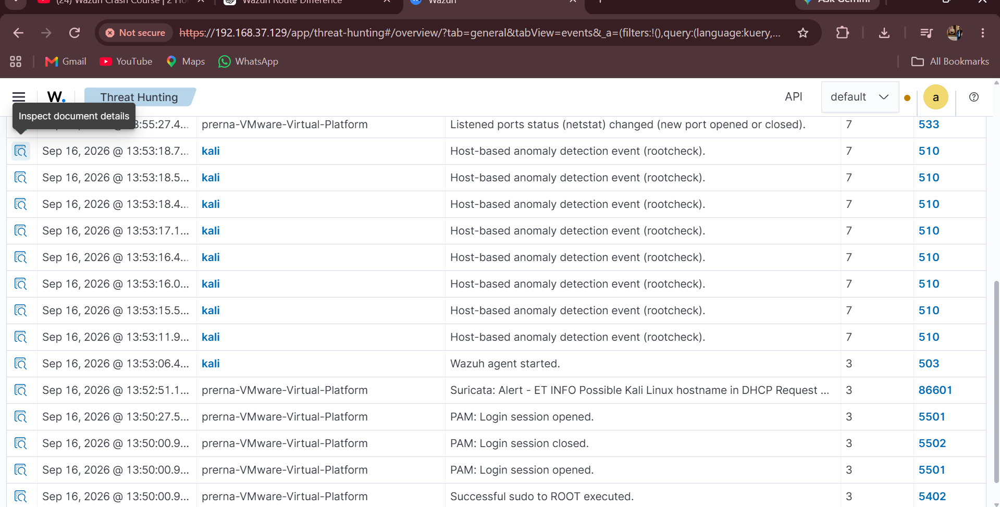
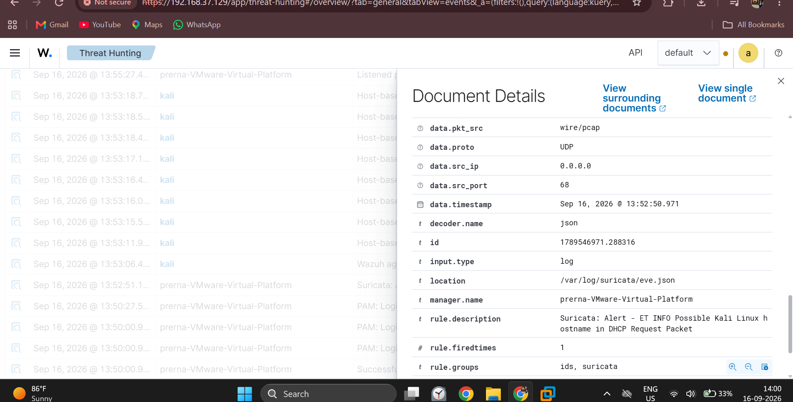
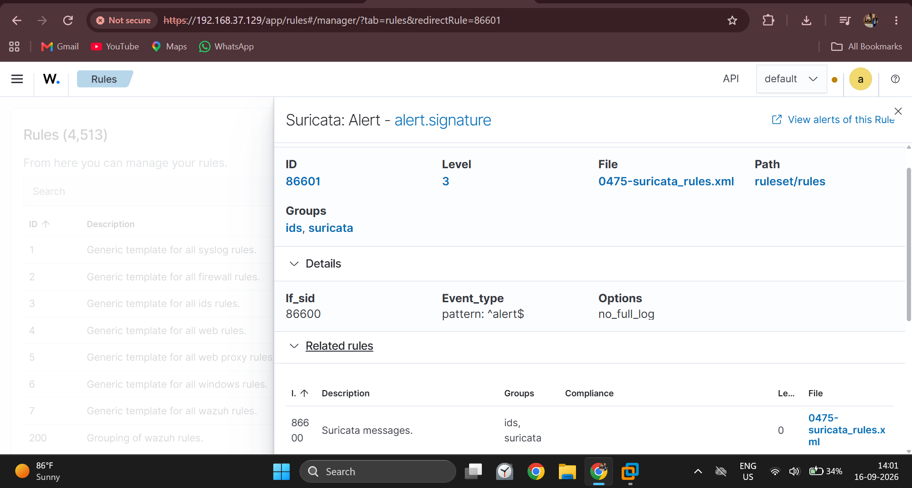

# Suricata IDS Log Monitoring with Wazuh

## Overview

This project demonstrates the integration of Suricata IDS with Wazuh for monitoring and analyzing network security events.

Suricata was configured on a Kali Linux endpoint to generate security logs. These logs were collected and monitored through Wazuh, where the events and alert signatures were investigated.

## Objective

- Monitor Suricata security logs using Wazuh
- Analyze network security events
- Review alert details
- Investigate Suricata alert signatures
- Understand a basic SOC network monitoring workflow

## Technologies Used

- Kali Linux
- Suricata IDS
- Wazuh
- Wazuh Agent
- Wazuh Manager
- Wazuh Dashboard
- Network Security Monitoring

## Architecture

Kali Linux
     ↓
Suricata IDS
     ↓
Suricata Security Logs
     ↓
Wazuh Agent
     ↓
Wazuh Manager
     ↓
Wazuh Dashboard
     ↓
Alert Investigation

## Monitoring Results

### 1. Suricata Logs

Suricata-generated security logs are displayed in the Wazuh dashboard.

### 2. Alert Details

The selected event was opened in Wazuh to examine the available event information.

### 3. Alert Signature

The Suricata alert signature was reviewed to identify the signature associated with the detected network event.

## Key Learning

- Suricata IDS log generation
- Wazuh log collection and monitoring
- Network security event analysis
- Alert signature analysis
- Basic SOC investigation workflow

## Conclusion

This project demonstrates a basic network security monitoring workflow by integrating Suricata IDS with Wazuh and analyzing the resulting security events through the Wazuh dashboard.
